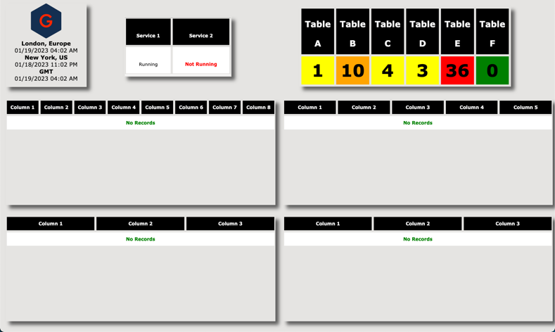

# Audit Dashboards
Connects to database tables in order to display record counts and create audible threshold alerts.



## Getting Started
- Adjust the ```Audit_Dashboard.php``` file to change the refresh rate of the data when its visible.
- Adjust the ```Audit_Dashboard.html``` file to flip through multiple dashboards within a specificed time range.

## Deployment
Specify your database connection and queries in the php file.

I strongly recommend including ``WHERE`` and ``LIMIT`` clauses to minimize the result set loading times.

Run the ```Audit_Dashboard_Demo.php``` in your browser to get a static demo of what the webpage will look like when running properly.

-----

## Credit
**Author:** Scott Grivner <br>
**Email:** scott.grivner@gmail.com <br>
**Website:** [scottgrivner.dev](https://www.scottgriv.dev) <br>
**Reference:** [Main Branch](https://github.com/scottgriv/php-web_utilities)