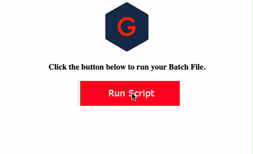

# Batch Script Refresh Utility
Run a batch file through a web interface without end user server access.

## Getting Started
- Go to the full ``update.php`` web server address in your web browser.
- Press the "Run Script" button.
- A success button will be shown when the script is done executing.

## Deployment
Ensure OS file permission to run the batch file.

-----

## Credit
**Author:** Scott Grivner  
**Email:** scott.grivner@gmail.com  
**Website:** [scottgrivner.dev](https://www.scottgriv.dev)  
**Reference:** [Main Branch](https://github.com/scottgriv/php-web_utilities)