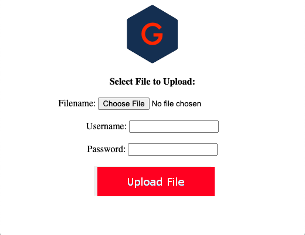

# File Upload Utility
Upload files to a remote FTP site through a web interface without end user server access.

## Getting Started
- Go to the full ``upload.php`` web server address in your web browser.
- Enter your FTP login credentials.
- Select and upload the file.

## Deployment
Ensure proper access and user credentials are used to connect to the FTP Server.

-----

## Credit
**Author:** Scott Grivner  
**Email:** scott.grivner@gmail.com  
**Website:** [scottgrivner.dev](https://www.scottgriv.dev)  
**Reference:** [Main Branch](https://github.com/scottgriv/php-web_utilities)
