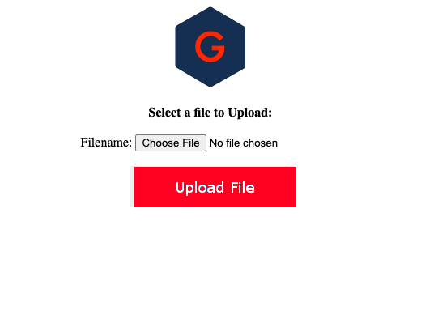

# SMB File Upload
Upload and move files using SMB protocol through a web interface without end user server access.

## Getting Started
- Go to the full ``upload.php`` web server address in your web browser.
- Select and upload the file.

## Deployment
- Edit the ``resources/config.ini`` file with the necessary credentials for connecting to the directory you plan on dropping the file in.
- Feel free to add your company's logo by replacing the ``images/logo.png`` file.

-----

## Credit
**Author:** Scott Grivner  
**Email:** scott.grivner@gmail.com  
**Website:** [scottgrivner.dev](https://www.scottgriv.dev)  
**Reference:** [Main Branch](https://github.com/scottgriv/php-web_utilities)
